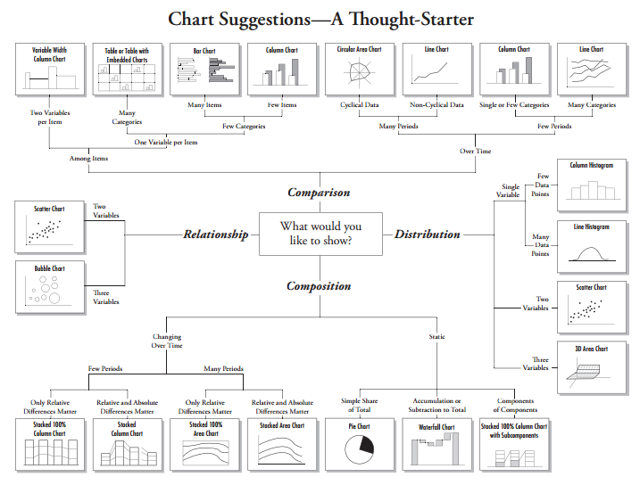

```{r setup, include=FALSE}
library(tufte)
library(ggplot2)
# invalidate cache when the tufte version changes
knitr::opts_chunk$set(tidy = FALSE, cache.extra = packageVersion('tufte'))
options(htmltools.dir.version = FALSE)
```

> _An approximate answer to the right question is worth a great deal more than a precise answer to the wrong question._
>
> `r quote_footer('--- John Tukey^[Super Freakonomics p. 224]')`

# Data Reference

`r newthought ('A very good starting')` place for data sets ^[http://researchguides.library.tufts.edu/data] Pay attention to the front page "Major Statistics/Data Providers" - these are widely used resources and repositories^[Where researchers share their datasets] 

`r newthought('While looking for data')` it is important to research and develop your research question ^[
Friendly librarians are available today and later to meet and discuss your research question and process :)
https://tischlibrary.tufts.edu/get-help/ask-librarian ]. At various stages you might break down your research question to:

**Unit of analysis: What level?** country, state, region, household

**Geography: Where?** Sub-Saharan Africa, India, Boston

**Time-Period: When?** 1980-2010

**Frequency: How often measured?** yearly, quarterly, hourly


# Data Analysis

Depending on your research question your method of analysis might require one specific framework or several. This is a conversation you need to have with your advisor. 

Decide what statistical tests, if applicable, you want to use ^[http://www.ats.ucla.edu/stat/mult_pkg/whatstat/]

Tisch Library subscribes to a number of a resources that can help too.

Safari Books^[http://www.library.tufts.edu/ezproxy/ezproxy.asp?LOCATION=PQSaTeBoOn] provides a collection of e-books on a breadth of technical subjects. 

Sage Research Methods ^[http://www.library.tufts.edu/ezproxy/ezproxy.asp?LOCATION=SageSRMO] provides reference materials on both quantitative and qualitative methodologies. 

Lynda.com ^[https://it.tufts.edu/lynda] is an excellent resources for high quality, self-guided video tutorials.


# Data Visualization



^[Emphasis on *Thought Starter*. Think about your research question and how you'd visually present it to your peers. What does it look like? How does (or doesn't) it match to the charts presented? ]

```{marginfigure}
http://extremepresentation.typepad.com/files/choosing-a-good-chart-09.pdf
```
```{marginfigure}
http://labs.juiceanalytics.com/chartchooser/index.html
```


`r newthought('There are many tools')` of varying learning curves available for creating charts. Using R or Python has the benefit of complete control of the look of your charts with the trade-off of a steeper learning curve. The code below is R and produces the charts to the right. Excel is a great option as well if time is of the essence and tinkering with R or Python is not an option. 


```{r fig-two-together,fig-margin, fig.margin = TRUE, fig.show='hold', cache=TRUE}
library(ggplot2)
mtcars2 <- mtcars
p <- ggplot(mtcars2, aes(hp, mpg, color = am)) +
  geom_point()
p
p + geom_smooth()
```

There are also free, web-based tools that create visually clean charts. Some very good ones are Raw ^[http://rawgraphs.io/] and Plotly ^[https://plot.ly/]. 

The library also subscribes to web-based mapping tools that make access to census surveys and other social science datasets much easier. Social Explorer ^[http://www.library.tufts.edu/ezproxy/ezproxy.asp?LOCATION=SocialExp] and Policy Map ^[http://www.library.tufts.edu/ezproxy/ezproxy.asp?LOCATION=PolMap] are very useful if you need to map census data without having to learn ArcGIS. Support for GIS and other data/statistical software can be found in the Data Lab (former Map Room) in Tisch Library ^[https://sites.tufts.edu/datalab/]

